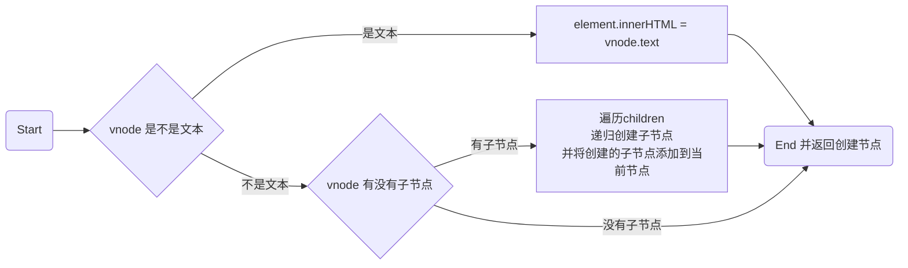

# createElement



## 代码

[`snabbdom.js`](./snabbdom.js)

<!-- @import "./snabbdom.js" {code_block=true line_begin=33} -->

## 示例

```javascript
createElement(h("div", {}, "文字")).nodeType === 1;
// true
createElement(h("ul", {}, [])).nodeType === 1;
// true
createElement(h("ul", {}, h("li", {}, "文字"))).nodeType === 1;
// true
```
