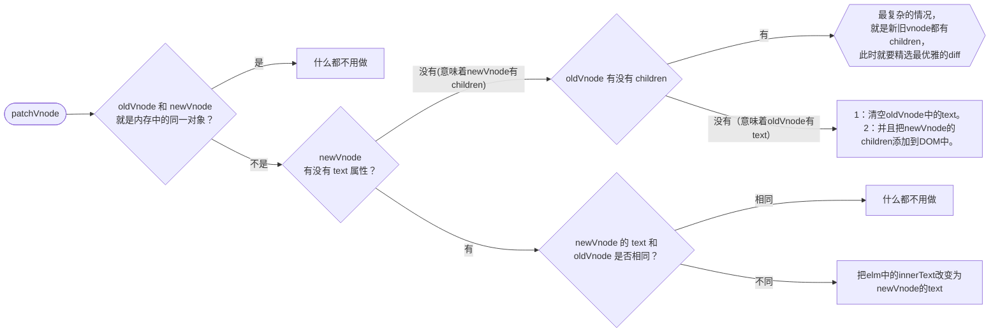

# PatchVnode

更新根节点



## 代码

[`snabbdom.js`](./snabbdom.js)

<!-- @import "./snabbdom.js" {code_block=true line_begin=54} -->

## 示例

```javascript
const example01 = h("div", {}, "文字");
const example02 = h("ul", {}, []);
const example03 = h("ul", {}, h("li", {}, "文字"));
patch(container, example01);
patch(container, example03);
```
